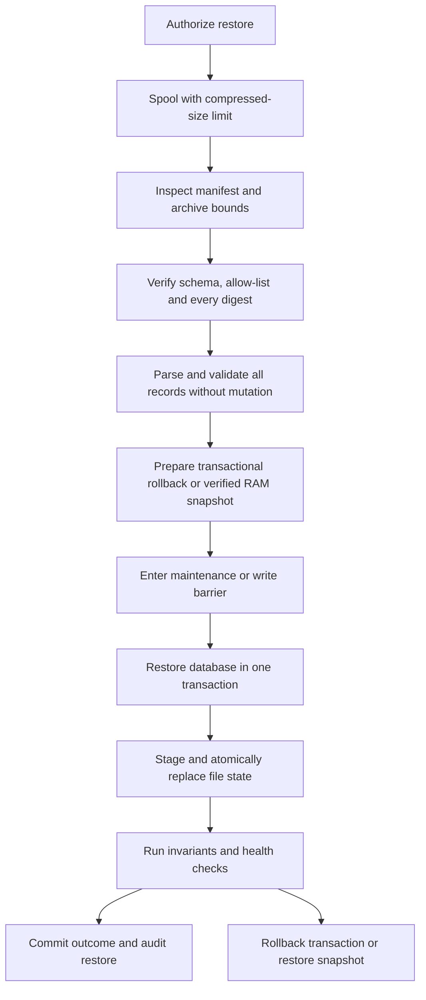

# Part 03. Backup And Recovery

> This is a normative component of the [Part 00 documentation authority](./PART_00_SYSTEM_UNIFICATION_SPECIFICATION.md).

The key words **MUST**, **MUST NOT**, **SHOULD**, **SHOULD NOT** and **MAY** are
normative. Numeric defaults may change only after workload measurement, while
the safety property behind every limit MUST be preserved.

## Central Authority And Material Divergence

This Part takes precedence over conflicting project-local documentation.
Project documents MUST adapt these rules to current project-specific values
without weakening them. A material implementation difference follows the
reporting and decision protocol in [Part 00](./PART_00_SYSTEM_UNIFICATION_SPECIFICATION.md#1-mandatory-material-divergence-protocol); stale local documentation is corrected and is not an alternative authority.

---
## 13. Recovery Contract Before File Format

A backup is correct only if a tested restore can recreate the promised state.
Start by defining:

- recovery point objective: how much recent data may be lost;
- recovery time objective: how long restore and verification may take;
- backup scope: complete service, one tenant/resource, or configuration only;
- replacement semantics: replace, merge or create a new revision;
- key dependency: which external secret or key is required to decrypt protected
  fields;
- version compatibility: which application and database schemas may restore
  the archive.

The application owns logical backup semantics. A shared backup agent may transport exact
opaque backup bytes to the approved remote destination, and the local update helper may stage those bytes for
an application update or rollback. Neither component may interpret domain
records or silently change archive meaning. Automatic scheduling, enrollment
and transfer lifecycle are defined in
[Service Agents: Deployment, Initialization And Lifecycle](./PART_09_SERVICE_AGENTS_DEPLOYMENT_AND_LIFECYCLE.md).

### 13.1 Settings Backup And Restore Experience

Part 01 section 5.5 defines the visual contract. `Create and download snapshot`
is one operator action: it creates a fresh logical ZIP and begins the
same-origin download when the archive is ready. Pending state prevents duplicate
creation. Completion identifies the timestamped filename; failure leaves
Settings open and provides a retry without claiming that a usable backup exists.

`Restore snapshot` opens the custom restore overlay. The overlay invokes the
operating system's native file picker, then shows sanitized filename, bounded
size and parsed format/version before confirmation. The native picker itself is
not replaced by simulated web UI. Archive validation completes before the
confirmation can start live mutation. Progress, successful health verification,
rollback and rollback failure remain explicit in the same operator workflow.

### 13.2 Backup Lifetime During An Application Update

The universal update warning and its save gate are defined in
[Part 01 section 10.8](./PART_01_INTERFACE_AND_INTERACTION_UNIFICATION.md#108-update-dialog-templates)
and [Part 05 section 34.3](./PART_05_CI_RELEASES_AND_LOCAL_UPDATES.md#343-mandatory-application-backup-gate).
They use this Part's standard full logical ZIP. A pre-update export MUST NOT
omit settings, identities or other required state, substitute a database-only
dump, or introduce a second incompatible archive format.

The same application-owned builder serves manual download, automatic remote
backup and update preparation. Each export captures a consistent recovery point.
Updating uses exactly the ZIP saved by the operator, not a second snapshot
generated after save confirmation. The operator avoids edits between that
recovery point and installation; a later rollback may discard newer changes.
When writers can run concurrently, the application must define and enforce its
snapshot/write-barrier policy rather than promise zero data loss.

| Stage | Allowed location and lifetime | Required observable result |
| --- | --- | --- |
| Standard update export | Bounded application memory or private verified tmpfs while creating/streaming | Authorized complete ZIP with filename, size and SHA-256 |
| Browser save | Native save stream or temporary browser memory/object URL until save and submission/cancellation | Verified save completion, or a separate explicit saved-copy acknowledgement |
| Durable manual recovery copy | Operator's computer | Exact saved ZIP kept for the documented recovery window |
| Accepted application update | Helper process memory until the operation and any automatic recovery terminate | Receipt matches scope, selected version, size, checksum and request ID |
| Path-based recovery tool | Private verified tmpfs, directory mode `0700`, file mode `0600`, only while that tool runs | Removal in success/error/cancellation cleanup; no fallback to a disk-backed temporary directory |
| Independent automatic backup | Designated remote backup storage reached through the authorized backup agent | Remote integrity/commit receipt under that pipeline's retention policy |
| Durable application-host job history | Bounded metadata only | Job/request identity, versions, checksum, size, outcome and non-secret deployment metadata; no ZIP or copied secret-bearing environment |

The two durable destinations for backup archives are the operator's computer
and designated remote backup storage. Application and helper hosts MUST NOT
accumulate retained update archives. Installed application data, volumes and
ordinary runtime configuration remain persistent; this rule does not turn
service state into temporary memory.

Temporary export data is removed after transfer, failure, cancellation or
expiry, with bounded startup cleanup for interrupted generation. The helper
releases in-memory backup bytes at the end of apply/automatic recovery.
Browser object URLs and archive/receipt references are released after use;
they MUST NOT enter local storage, indexed databases, service-worker caches,
analytics or logs. Download/upload responses use authenticated authorization
and `Cache-Control: no-store`; public proxy caching and secret-bearing request
body logs are prohibited.

The decoded ZIP ceiling at the privileged update boundary is 128 MiB by
default. The application export/upload, browser, proxy, helper and restore tool
must agree on an effective supported ceiling no higher than the smallest
participating limit. Account for simultaneous buffers, encoding expansion and
tmpfs use in the memory budget. Compressed size, member count, expansion ratio
and total uncompressed-size checks remain independent. An oversized ZIP blocks
the update with a clear reason before mutation; it must not be truncated or
made acceptable by removing required content.

If tmpfs is required but unavailable or too small, fail before mutation.
Restrict core dumps and any swapping of secret-bearing memory according to the
host security profile. Do not silently spill update backups into durable
temporary files. The automatic backup agent's bounded transfer spool and
resumable retries are governed by its own lifecycle contract; an in-flight
spool is not another long-term backup repository and is deleted after verified
remote commitment.

For a normal uninterrupted failed update, automatic recovery can use the
in-memory original ZIP. After a helper/host restart, or for a later manual
rollback, the operator reselects the original saved ZIP. Verify its SHA-256
against the scoped job before restoring. A historical `rollback_available`
flag records recovery capability, not the presence of archive bytes on disk.
Legacy retained update archives are cleaned under the documented migration
policy only after the operator has been told to preserve needed copies.

An ordinary reboot preserves the installed service and its persistent state;
it does not require importing backups. Shared-component binary updates skip
the application ZIP/save gate while preserving their own configuration and
bindings through a verified upgrade/recovery contract.

## 14. What A Backup Must And Must Not Contain

### 14.1 Mandatory Logical State

A complete logical backup MUST include, when applicable:

| Category | Required content |
| --- | --- |
| Identity | Stable IDs, public certificates, fingerprints, status and revocation or deny-list records |
| Authoritative domain state | Current records, relations, ordering and ownership needed to reproduce behavior |
| Configuration | Application settings and topology that are not deployment secrets |
| Operator presentation and recording | Settings-card order, appearance preferences and optional routine service-request logging preference |
| Automatic backup policy | Per-service/per-pipeline enabled state, interval, kind, stable target/profile reference and revision/provenance needed to reconcile the policy |
| Functional connection intent | Non-secret scoped bot/Adapter/function selection and binding intent; gateway-owned credentials remain excluded |
| Authentication continuity | Access-Key verifier or password hashes and parameters only when operator access must remain usable |
| Protected recoverable material | Ciphertext plus encryption metadata, never an unprotected private value |
| Compatibility | Backup format, schema version, application version and creation time |
| Integrity | Per-member digest, uncompressed size and record count |
| Semantics | Scope, replace/merge policy and required restore order |

Revision history may be included when history itself is part of the product
contract. Export and restore MUST be symmetric: every advertised restorable
section is either consumed or explicitly labeled diagnostic-only.

Backup schedules are now authored in the owning service, as specified in
[Part 09 section 5](./PART_09_SERVICE_AGENTS_DEPLOYMENT_AND_LIFECYCLE.md#5-ongoing-neptune-interaction).
If the authoritative policy is stored through a control-plane backend, the
service export must obtain that scoped policy consistently or fail explicitly;
an unavailable dependency is not permission to omit user settings.
Desired policy and the agent's observed/applied revision are different data.
Last-run diagnostics may be included as diagnostics, but cannot authorize a
new command during restore.

Restore preserves the operator's enabled/interval intent for each pipeline.
Before execution resumes, validate the destination, ownership, enrollment and
agent-applied policy. Until then show `Restored policy · pending verification`
with execution paused, not a silently rewritten disabled preference. Reconcile
and acknowledge one policy revision; do not replay obsolete queued manual runs,
copy another deployment's schedule ownership or make both the old and restored
instance writers. A control-plane outage cannot trigger a default 24-hour
replacement of the saved interval.

### 14.2 Conditional Content

- Audit history and raw logs are optional diagnostic attachments. Their
  retention and privacy policy remain active inside a backup.
- Active sessions SHOULD be excluded by default. If continuity requires them,
  store only non-reversible session hashes and expire or revalidate them after
  restore.
- Cached external artifacts MAY be excluded when they are immutable,
  checksum-addressed and reliably downloadable. Include the desired version
  and digest so they can be reconstructed.
- Encrypted private material is useful only when the recovery process also has
  a separately protected key. Document that dependency and test it.

### 14.3 Forbidden Content

An application logical backup MUST NOT contain:

- plaintext passwords;
- bearer, API, service, session, enrollment or one-time tokens;
- cookies;
- decrypted connection credentials;
- raw private keys without an explicit encryption and escrow design;
- `.env` files;
- temporary files, update staging, caches or build output;
- container images or other reproducible binary dependencies;
- log records that bypass normal secret redaction.

Password hashes, public certificates and ciphertext are still sensitive. The
archive requires restricted access even when it contains no plaintext secret.
Deployment secrets use a separate secret-manager or encrypted disaster-recovery
procedure; they are not smuggled into the application backup.

## 15. Archive And Manifest Design

The operator-facing download and the opaque backup transported to a local
updater MUST be a ZIP archive with a `.zip` filename and the
`application/zip` media type. A complete logical backup MUST NOT be exposed as
a standalone downloadable JSON document: JSON or JSONL records belong inside
the bounded archive and are covered by its manifest. Restore endpoints MAY
accept a documented legacy JSON format only as a migration path; all newly
created backups use ZIP.

### 15.1 Recommended Layout

```text
manifest.json
data/
  configuration.json
  identities.jsonl
  resources.jsonl
  relations.jsonl
history/
  revisions.jsonl
diagnostics/
  audit.jsonl
README.txt
```

Only documented, allow-listed member names are accepted. JSON uses UTF-8,
stable field names and unambiguous UTC timestamps. Large collections use JSONL
so export and restore can stream records.

The manifest contains at least:

```json
{
  "format": "logical-backup",
  "schema_version": 1,
  "created_at": "<UTC timestamp>",
  "scope": "complete",
  "source_version": "<semantic version>",
  "restore_mode": "replace",
  "files": {
    "data/resources.jsonl": {
      "sha256": "<hex digest>",
      "uncompressed_bytes": 0,
      "records": 0
    }
  }
}
```

The field names are a generic example, not a required product namespace.

### 15.2 Integrity, Confidentiality And ZIP Safety

- Calculate a SHA-256 digest for every data member and verify all digests
  before mutation.
- A checksum detects corruption; it does not authenticate the publisher. When
  archives cross a trust boundary, sign the manifest or wrap the archive in an
  authenticated encryption format.
- Do not rely on legacy ZIP passwords.
- Enforce maximum compressed size before reading the upload.
- Inspect the directory before reading members. Enforce total uncompressed
  size, per-member size, member count and compression ratio.
- Reject absolute paths, drive-qualified paths, `..`, links and unknown files.
- Never extract directly into a live directory. Read allow-listed members or
  extract into a private staging directory with safe generated paths.
- Sanitize any optional log filename to its basename and extension allow-list.

Build large archives incrementally into a bounded stream or private
mode-`0600` spool. For the update workflow, any file-backed spool MUST be
verified tmpfs as specified in section 13.2. Stream rows from the database and
files from disk. Do not first build every table as a list, serialize every
member into bytes and then copy the entire ZIP into another RAM buffer.

Reference restore endpoints currently use compressed upload ceilings between
32 MiB and 128 MiB, and the privileged update path accepts at most 128 MiB of
decoded logical-backup bytes. A unified product should select one documented
budget per backup scope and then size request, spool, temporary-disk and RAM
limits from that same value. The compressed ceiling never replaces the
uncompressed archive limits above.

## 16. Restore Procedure

The safe restore sequence is:



Detailed rules:

1. Require an authenticated operator and an explicit confirmation describing
   replace or merge behavior.
2. Bound the upload in memory or a private spool with a hard compressed-size
   limit; update recovery uses only the RAM/tmpfs policy in section 13.2.
3. Validate archive structure, manifest schema, source compatibility, member
   bounds and every digest.
4. Parse all records into validated, bounded batches before deleting or
   overwriting live state.
5. Prepare transactional rollback with a complete rollback journal, or create
   a fresh pre-restore snapshot and verify its checksum. Any snapshot needed
   during update recovery stays in private verified tmpfs and is cleaned at
   the operation boundary; it is not another retained ZIP.
6. Stop concurrent writers or establish a database write barrier.
7. Restore in dependency order: settings and identities, primary resources,
   relations, derived state, optional history and diagnostics.
8. Use one database transaction where possible. If filesystem state is also
   restored, stage it and switch by atomic rename at the commit boundary.
9. Recompute derived indexes and invalidate unsafe active sessions.
10. Check referential integrity, counts, required identities and local health.
11. Record who restored which archive digest, source version, scope, result and
    correlation ID.
12. On failure, roll back the transaction or reapply the pre-restore snapshot;
    never leave a half-restored service reported as healthy.

Restoring a prior version during an update SHOULD start the old application
code first and call its restore contract second. The old code is the component
most likely to understand the old logical schema.

### 16.1 Findings From The Reference Implementations

Strong implemented patterns include authenticated backup endpoints, explicit
format versions, transactional database restores, creation of new document
revisions instead of destructive history edits, per-file checksums in one
archive profile, safe basename handling for restored log files and update-time
backup checksums.

The following limitations require correction in a unified design:

- a single large JSON backup has no per-section digest or streaming boundary;
- some manifests list members but do not checksum them;
- some exports contain history or audit data that restore silently ignores;
- one logical payload includes a connection secret after decryption, which
  violates the no-plaintext-secret rule;
- several export and import paths hold the upload, all rows, member JSON and
  the archive in memory simultaneously;
- compressed upload limits exist without complete uncompressed-size,
  compression-ratio and member-count limits;
- archive encryption or manifest signatures are not universally enforced;
- the external key needed for encrypted identity restoration is not always
  represented as a tested recovery dependency.

## 17. Backup Test Matrix

### 17.1 Pre-Push Backup-Scope Audit

Before every branch or tag push, inspect the outgoing diff for changes to
authoritative or persisted state. This includes database tables and columns,
settings, files, object storage, identities, revisions, queues, indexes that
cannot be reconstructed, migrations, retention rules and ownership or tenancy
boundaries. The audit itself is mandatory even when the result is `N/A`.

For every added, renamed, transformed or removed value, record exactly one
backup classification:

- **mandatory**: export and restore it, include it in the manifest and compare
  it during round-trip verification;
- **conditional**: state the inclusion condition, feature/version marker and
  restore behavior when the condition is absent;
- **derived**: exclude it only when deterministic reconstruction is documented
  and tested;
- **forbidden**: exclude plaintext secrets, ephemeral credentials, caches and
  other prohibited material and test that exported bytes do not contain it.

An affected push MUST update the archive schema/version, manifest inventory,
digests, export query, restore mapping, validation limits and documentation as
applicable. It MUST also define how an older supported archive supplies a newly
introduced value: explicit default, deterministic derivation, migration or a
clear incompatibility rejection before mutation. Silent omission and silent
defaulting are forbidden.

Changing backup coverage or restore semantics requires a real round trip from
representative state into an empty compatible instance, comparison of all
authoritative values and an exercised failure/rollback path. Narrow unit tests
may supplement but do not replace that round trip. A `PASS` records the exact
commands and results for the outgoing revision. `N/A` records the inspected
paths and why none can affect persisted state, archive content or restore.

### 17.2 Required Test Cases

- [ ] Export from real data, restore into an empty compatible instance and
      compare authoritative state.
- [ ] Restore over existing data and verify documented replace or merge
      semantics.
- [ ] Corrupt each member and prove digest verification fails before mutation.
- [ ] Reject missing required members, unknown schema and unsupported future
      versions.
- [ ] Reject absolute paths, traversal paths, links and duplicate names.
- [ ] Reject an archive within compressed limits but above uncompressed,
      per-member, count or ratio limits.
- [ ] Interrupt parsing and database import and prove live state remains
      consistent.
- [ ] Search the exported bytes for known plaintext test credentials and
      tokens; none may appear.
- [ ] Restore encrypted identity material using the documented external key in
      a clean disaster-recovery environment.
- [ ] Verify pre-restore snapshot and rollback behavior.
- [ ] Measure peak RAM and temporary disk against explicit budgets.

### 17.3 Update Backup Acceptance

- [ ] A full saved ZIP restores all promised state through the same recovery
      contract as a manual/automatic full export; update preparation does not
      change member inventory or schema.
- [ ] Cancelled/failed generation and save, missing acknowledgement, expired
      receipt, changed target and wrong bytes all leave installation blocked.
- [ ] The accepted bytes match the operator copy exactly; no second export is
      created during submission or apply.
- [ ] Authenticated transfer, no-store responses, redaction, effective size
      limits, peak memory and archive-expansion limits are exercised.
- [ ] Successful update, rejected update, failed apply, automatic rollback,
      rollback failure, disconnected download and helper restart leave no
      retained update ZIP or copied secret-bearing environment on the host.
- [ ] A matching operator copy enables supported later recovery; a mismatched
      copy is rejected before mutation. A normal reboot preserves runtime data.
- [ ] Legacy-retention migration preserves needed job/checksum metadata and
      cleans only the managed old archive scope after documented preparation.
- [ ] Shared-component updates skip application backups without losing their
      configuration, bindings or authenticated recovery controls.

### 17.4 Service-Owned Settings Round Trip

- [ ] Export/restore preserves card order, recorder preference, functional
      binding intent and every independent backup/mirror enabled/interval policy.
- [ ] Missing externally persisted schedule policy fails export explicitly;
      restore does not replace it with defaults or omit a pipeline.
- [ ] Restored desired policy remains visible while execution awaits scope,
      destination/enrollment verification and agent acknowledgement.
- [ ] Reconciliation rejects stale revisions and old manual commands, preserves
      an active transfer's recovery state and prevents two deployments from
      executing the same restored ownership simultaneously.
- [ ] Logical archives contain safe connection intent, not bot/provider tokens,
      setup codes, client bearer credentials or root-administration material.
